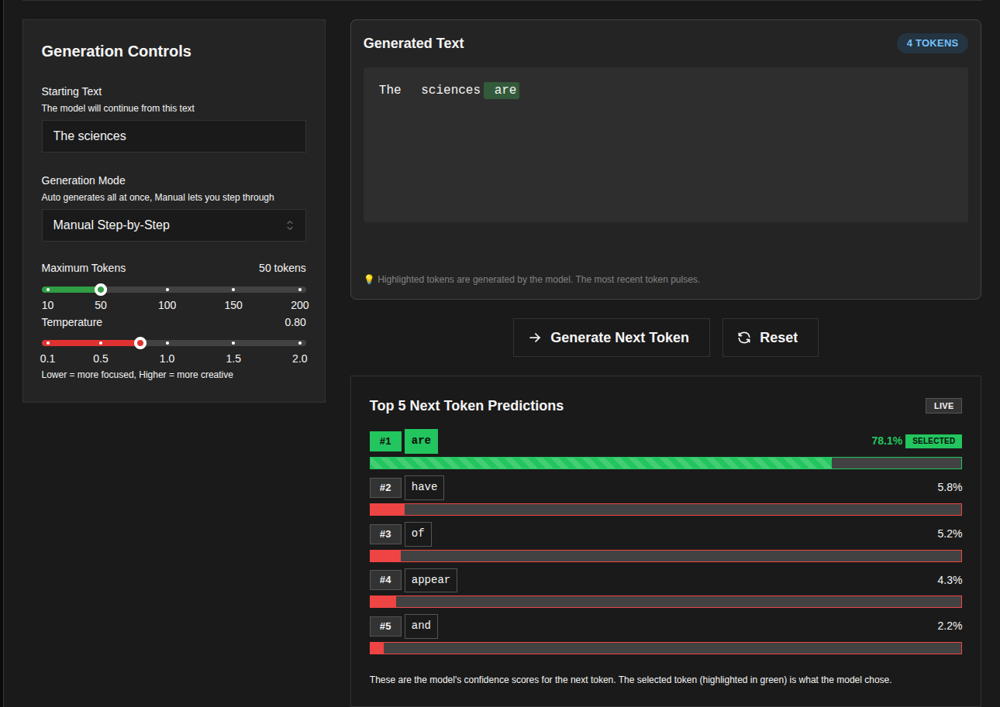
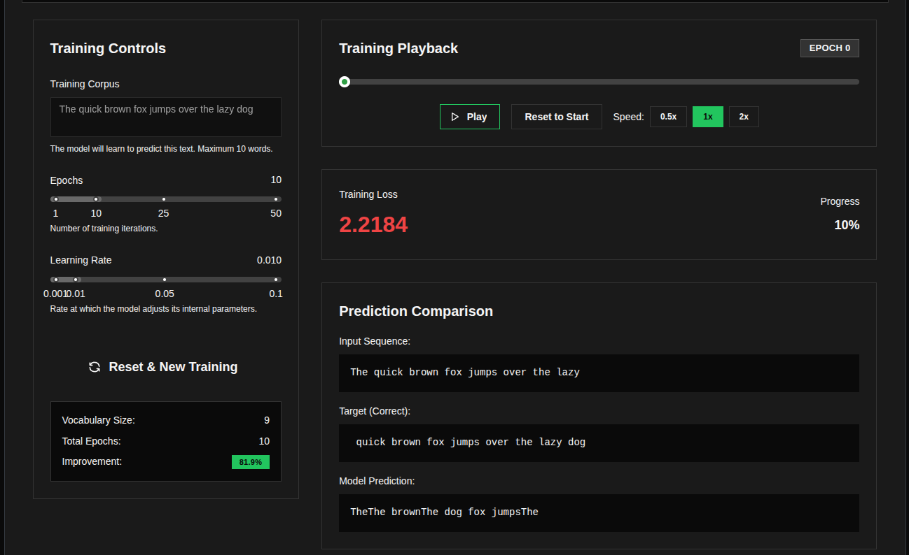
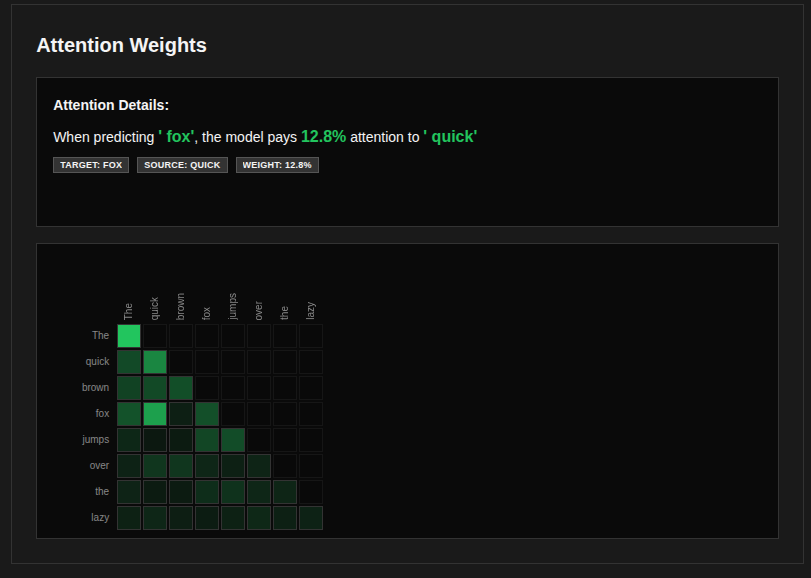

# QKViz — Inside the Thinking of Stochastic Parrots

An interactive, open-source visualization of how large language models actually work under the hood. Train a small transformer on any short text, watch it predict token by token, and inspect the attention weights and probability scores behind every decision.

**[Live Demo →](https://0xahmedk.github.io/qkviz)**

---

## Screenshots

| Generation | Training Lab | Attention Heatmap |
|:---:|:---:|:---:|
|  |  |  |

---

## What it does

**Generation tab** — A pre-trained GPT-style transformer (trained on Ibn Khaldun's *Al-Muqaddimah*) generates text one token at a time. Every step shows the full probability distribution across the vocabulary, including logits and percentages for the top candidates. You can step through manually or let it run automatically, and adjust temperature to see how it shifts the distribution.

**Training Lab** — Provide any short sentence (up to 10 words), set epochs and learning rate, and train a fresh model from scratch in the browser. The full training run is recorded and played back as a frame-by-frame DVR. Each frame shows the loss at that epoch, the input sequence, the correct target, and the model's actual prediction.

**Attention Heatmap** — Every training frame includes an NxN attention matrix with tokens labelled on both axes. Hover any cell to see the exact attention weight between a token pair. Click a cell to open the Vector Inspector, which shows the raw query and key vectors that produced that score.

---

## Tech stack

| Layer | Stack |
|---|---|
| Frontend | React, TypeScript, Mantine, Recharts |
| Backend | Python, FastAPI, PyTorch |
| Model | GPT-style transformer, character-level tokenizer, trained on *Al-Muqaddimah* |

---

## Running locally

### Prerequisites

- Node.js 18+ and pnpm
- Python 3.9+

### Backend

```bash
cd backend
pip install -r requirements.txt

# Train the model (5–10 min on CPU)
python train.py

# Start the API server
python main.py
# Runs at http://localhost:8000
```

### Frontend

```bash
cd frontend
pnpm install
pnpm dev
# Runs at http://localhost:5173
```

---

## Project structure

```
qkviz/
├── assets/                      # Screenshots
├── backend/
│   ├── app/                     # Core application package
│   │   ├── model.py             # GPT architecture (transformer blocks, attention heads)
│   │   ├── data.py              # Word-level tokenizer and data loading
│   │   └── trainer_dvr.py       # Training simulator for the DVR playback feature
│   ├── tests/                   # Test suite
│   ├── assets/                  # Training corpus (Al-Muqaddimah)
│   ├── main.py                  # FastAPI server entry point
│   ├── train.py                 # Training script
│   ├── run.sh                   # Convenience helper (install, train, serve, test)
│   ├── logit_model.pth          # Saved model weights (generated)
│   ├── tokenizer.pkl            # Saved tokenizer (generated)
│   └── requirements.txt
└── frontend/
    └── src/
        ├── App.tsx              # Main layout and tab structure
        ├── components/          # TokenDisplay, ProbabilityChart, VectorInspector, TermTooltip, etc.
        ├── pages/               # TrainingLab
        └── services/            # API client
```

---

## Model details

The pre-loaded model is a minimal GPT trained from scratch on Ibn Khaldun's *Al-Muqaddimah* (14th-century treatise on history and civilization). It uses character-level tokenization, 4 transformer layers, 4 attention heads, and a 64-dimensional embedding. It was never meant to produce coherent output — the point is to make the mechanism visible, not to impress with the results.

---

## Author

**Ahmed Khan** — [0xahmedk.me](https://0xahmedk.me)
